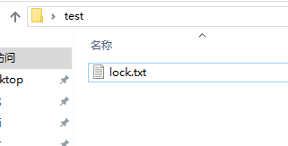
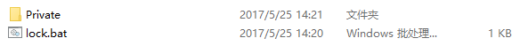
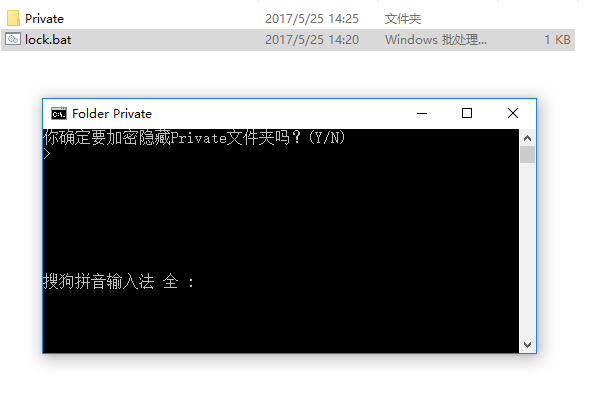

1. 启动命令行：win+R,输入cmd 
2. 在文件上面直接运行命令行
在当前文件目录下，空白处，按着shift键右击，会出现在此处打开命令窗口

3. 复制文件的路径，在要复制的文件上单击选中，然后按住shift键的同时右击，这时候在右击选择菜单中会出现复制为路径
4. 如何不通过加密软件对我们的文件进行加密
- #### 新建一个test文件夹，名字随意，在这个文件夹新建一个文本文档，比如lock,如图

    
- #### 用编辑器打开lock.txt文本文档，里面写入如下代码
```shell
cls
@ECHO OFF
title Folder Private
if EXIST "HTG Locker" goto UNLOCK
if NOT EXIST Private goto MDLOCKER
:CONFIRM
echo 你确定要加密隐藏Private文件夹吗？(Y/N)
set/p "cho=>"
if %cho%==Y goto LOCK
if %cho%==y goto LOCK
if %cho%==n goto END
if %cho%==N goto END
echo Invalid choice.
goto CONFIRM
:LOCK
ren Private "HTG Locker"
attrib +h +s "HTG Locker"
echo Folder locked
goto End
:UNLOCK
echo 输入密码来解锁文件夹
set/p "pass=>"
if NOT %pass%== 在此设置密码 goto FAIL
attrib -h -s "HTG Locker"
ren "HTG Locker" Private
echo Folder Unlocked successfully
goto End
:FAIL
echo Invalid password
goto end
:MDLOCKER
md Private
echo Private created successfully
goto End
:End
```

写好以后如下

```
cls
@ECHO OFF
title Folder Private
if EXIST "HTG Locker" goto UNLOCK
if NOT EXIST Private goto MDLOCKER
:CONFIRM
echo 你确定要加密隐藏Private文件夹吗？(Y/N)
set/p "cho=>"
if %cho%==Y goto LOCK
if %cho%==y goto LOCK
if %cho%==n goto END
if %cho%==N goto END
echo Invalid choice.
goto CONFIRM
:LOCK
ren Private "HTG Locker"
attrib +h +s "HTG Locker"
echo Folder locked
goto End
:UNLOCK
echo 输入密码来解锁文件夹
set/p "pass=>"
if NOT %pass%== 456123 goto FAIL
attrib -h -s "HTG Locker"
ren "HTG Locker" Private
echo Folder Unlocked successfully
goto End
:FAIL
echo Invalid password
goto end
:MDLOCKER
md Private
echo Private created successfully
goto End
:End
```

- #### 然后将lock.txt改为lock.bat,注意后缀发生了变化。之后双击lock.bat，他会自动在lock.bat所在的目录生成一个Private目录，如图

    

- #### 将我们要加密的文件扔进Private文件就可以了，然后再次点击lock.bat,这时会弹出cmd命令让你确认，如图我们输入Y
	

- #### 输入Y以后Private目录直接就被隐藏了，然后我们再次双击lock.bat,他会要求我们输入密码，我们输入我们上面设置的密码，回车以后如果密码正确，Private文件就又出来了

	

如果你将文件转移，记得lock.bat与Private目录一起