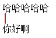
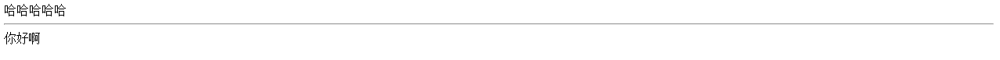
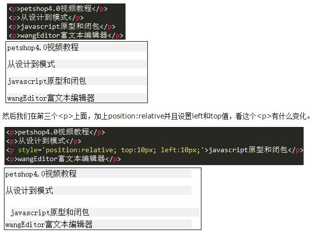
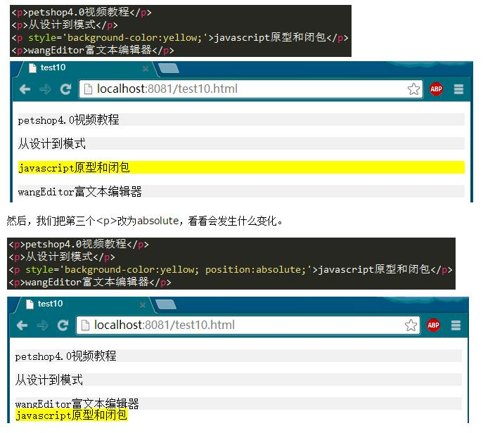

2017.3.15
---
1. 点击label包含的文字，输入框获得焦点
+ 直接用label标签包含
```html
<label>
  姓名：<input type="text">
</label>
```
+ 利用label的for属性，让他的值等于input的id值
```html
<label for="name1">姓名：</label>
<input type="text" name="name2" id="name1">
```

2. 使用input，type="radio"的时候，要想实现多个选一个的效果（只能选择一个）,**name值一定要一致**
```html
<div>性别：</div>
<label for="sex-1">女</label>
<input type="radio" name="sex" id="sex-1">
<label for="sex-2">男</label>
<input type="radio" name="sex" id="sex-2">
<label for="sex-3">保密</label>
<input type="radio" name="sex" id="sex-3">
```
3. 关于radio单选按钮的checked属性，以及input的disabled属性控制问题
```html
<html>
	<head>
		<title></title>
		<meta charset="utf-8">
		<script type="text/javascript" src="http://cdn.bootcss.com/jquery/1.9.1/jquery.min.js"></script>
		<script type="text/javascript">
			$(function(){
				//修改radio的单选属性
				$("#div1 input")[0].checked=true;
				//或者。注意，attr在1.6+版本设置radio属性貌似不好使
				//$("#sex-2").attr('checked',true)
				//注意,这样写会报错,attr不是一个函数
				//$("input[name='sex']")[1].attr('checked',false)
				//或者，注意，prop在jQuery的1.6+版本才有效
				//$("#sex-3").prop('checked',true)
				//1.6+版本控制（此例为1.9.1）input的disabled的属性
				//$("#detial1").attr('disabled',true)
				//$("#detial1").removeAttr('disabled')
				//注意$("#detial1").attr('disabled');获取不到属性的值，返回的是undefined，这时候必须用prop
//				设置disable的值为true
//				$("#detial1").prop('disabled',true)
//				获取disabled的值
//				$("#detial1").prop('disabled')
//				移除disabled
//				$("#detial1").removeProp('disabled')
//				获取checked的值
//				$("#sex-1").prop('checked')
//				设置checked的选中与不选中
//				$("#sex-1").prop('checked',true)
			})
		</script>
	</head>
	<body>
		<div id="div1">
			<label>性别：</label>
			<label for="sex-1">女</label>
			<input type="radio" name="sex" id="sex-1">
			<label for="sex-2">男</label>
			<input type="radio" name="sex" id="sex-2">
			<label for="sex-3">保密</label>
			<input type="radio" name="sex" id="sex-3">
		</div> 
		<div id="div2">
			<label><input type="text" id="detial1" value="1" disabled></label>
			<label><input type="text" id="detail2" value="100"></label>
		</div>
	</body>
</html>
```

2017.3.16
---
1. 版权声明问题
```html
&copy;这个东西是版权符，在网页里面会自动被解析
<div>
  &copy;2017 &nbsp;&nbsp;杭州远方光电信息股份邮箱公司版权所有
</div>
```
2. 关于a标签跳转的问题
```html
 “#” 包含了一个位置信息，默认的锚是#top 也就是网页的上端。
而javascript:void(0), href="javascript:;"  仅仅表示一个死链接。
在页面很长的时候会使用 # 来定位页面的具体位置，格式为：# + id。
如果你要定义一个死链接请使用 javascript:void(0) 。
<a href="#">与<a href="javascript:void(0)">
<a href="javascript:void(0);">点我没有反应的!</a> 
<a href="####">点我没有反应的!</a> 
<a href="#pos">点我定位到指定位置!</a> 
<br> 
<br> 
<p id="pos">尾部定位点</p>
```
**IE8不支持href="javascript:void(0)"和href="javascript:;"这时候使用会出错！。
2017.3.17
---
1. 关于背景透明
```css
.opacity{   
filter:alpha(opacity=50); /* IE */  
-moz-opacity:0.5; /* 老版Mozilla */  
-khtml-opacity:0.5; /* 老版Safari */  
opacity: 0.5; /* 支持opacity的浏览器*/  
}  
```

2.关于box-shadow

2017.3.18
----
1. IE8引入jQuery的时候兼容问题，详细：http://www.cnblogs.com/Gabriel-Wei/p/6573874.html
看代码
```
	<html>
		<head>
			<title></title>
			<meta charset="utf-8">
			<script type="application/javascript"   src="lib/js/jQuery v1.10.2.js">
			</script>
			<script>
				$(function(){
					$("#div1").click(function(){
						alert("你好");
					})
				})
			</script>
		</head>
		<body>
			<dvi id="div1">你好</dvi>
		</body>
	</html>
```
这段代码在Chrome下面运行正常，但是在IE8就会报错，说$未定义,原因在于这段代码：
~~~
<script type="application/javascript"   src="lib/js/jQuery v1.10.2.js">
~~~
将他改为：
~~~
<script type="text/javascript"   src="lib/js/jQuery v1.10.2.js">
~~~
就正常了

2017.3.19
---
1. 响应式设计，媒体查询写法
```css
	/*渐进式增强，注意chrome浏览器支持的最小font-size是12，
	也就是12以下，chrome浏览器默认还是12，低于12只对ie和Firefox有效*/
	@media (max-width: 538px){
	html{font-size: 8px}
	} /*<=638的设备*/
	@media (min-width: 538px){
	html{font-size: 8px}
	} /*>=538的设备*/
	@media (min-width: 638px){
	html{font-size: 10px}
	} /*>=638的设备*/
	
	@media (min-width: 700px){
	html{font-size: 12px}
	} /*>=700的设备*/
	
	@media (min-width: 1024px){
	html{font-size: 13px}
	} /*>=1024的设备*/
	
	@media (min-width: 1100px) {
	html{font-size: 14px}
	} /*>=1100的设备*/
	@media (min-width: 1280px) {
	html{font-size: 16px;}
	} /*>=1280的设备*/
	
	@media (min-width: 1366px) {
	
	html{font-size: 16px;}
	}  
	
	@media (min-width: 1440px) {
	html{font-size: 20px;}
	} 
	
	@media (min-width: 1680px) {
	html{font-size: 22px;}
	} 
	@media (min-width: 1920px) {
	html{font-size: 25px;}
	} 
```

2. 关于meta标签的使用(不断更新中)
X-UA-Compatible是自从IE8新加的一个设置，对于IE8以下的浏览器是不识别的。 通过在meta中设置X-UA-Compatible的值，可以指定网页的兼容性模式设置。
在网页中指定的模式优先权高于服务器中(通过HTTP Header)所指定的模式。
```html
<meta http-equiv="X-UA-Compatible" content="IE=7">  
以上代码告诉IE浏览器，无论是否用DTD声明文档标准，IE8/9都会以IE7引擎来渲染页面。  
<meta http-equiv="X-UA-Compatible" content="IE=8">  
以上代码告诉IE浏览器，IE8/9都会以IE8引擎来渲染页面。  
<meta http-equiv="X-UA-Compatible" content="IE=edge">  
以上代码告诉IE浏览器，IE8/9及以后的版本都会以最高版本IE来渲染页面。  
<meta http-equiv="X-UA-Compatible" content="IE=7,IE=9">  
<meta http-equiv="X-UA-Compatible" content="IE=7,9">  
<meta http-equiv="X-UA-Compatible" content="IE=Edge,chrome=1">
如果支持Google Chrome Frame：GCF，则使用GCF渲染；如果系统安装ie8或以上版本，则使用最高版本ie渲染；否则，这个设定可以忽略。
```

2017.3.20
---
1.关于hr标签的使用
- 将hr变为一个竖线，这时候width没有效果,可以用相对来控制他
```html
    width: 82px;
    display: inline;
    border: 1px solid #FF0000;
    text-align: left;
    position: relative;
    left: 4px;
```


- 不给他任何css样式的时候



- 如果想让他和"哈哈哈"在一行上,哈哈容器必须是行内元素
```
width: 100px;
    display: inline-block;
    border: 1px solid #FF0000;
    text-align: left;
```


2017.3.22
---
1.登录页面，点击回车键（键盘enter键），自动登录
说明：其实就是模拟了用户点击了页面的登录按钮

```
$("body").keydown(function(){
		//如果监控到按下了enter键，对应数字是13
		if(event.keyCode == "13"){
			$(".btn").click();
		}
   })
```

2.如果更改UI框架的css样式！！规则
- 如果是单页面，直接重写一个css样式，引入的时候，注意引入顺序，将原来的覆盖掉就好了
- 不许更改原有属性类的名称，如果原有类里面的样式需要更改，可以考虑重写一个类，将他覆盖
eg
```css
input-text{
	position:relative;
	top:10px;
	left:10px;
	width:100%
}
这时候我发现它的width值和我的要求不符，我们这么修改
input-text-1{
	width:50%;
}
然后在HTML文档里面在引入这个类覆盖他
```

- 如果必须修改某各类（这个类可能是js动态写入，我们没法控制），必须将原来的类注释掉保存一份，不许直接删掉！！！！不能因为更改了一个页面而影响整站的布局，这样我们以后出了问题也好修改过来！！
eg
```css
label.error{
	color:red;
	position:absolute;
	right:20px;
	top:10px;
}
像validate里面的这个错误信息提示，样式控制有问题，我们自己重写的时候，直接把上面注释掉，保留一份，然后重写我们的样式。
label.error{
	color:red;
	position:relative;
	left:10px;
	top:0;
	display:inline !important;
}
```

3.关于validate自定义表单验证
里面rules以及messages,对应的都是每个输入框的name值
- 应用场景：一个密码更改页面，我想验证旧密码与新密码是否相同，如果相同就给他提示不能与原密码相同
html文档结构：
```html
<ul>
	<li>
		<label for="oldPassword" class="label">旧密码</label>
		<input type="password" class="oldPassword" id="oldPassword" name="oldPassword" palceholder="" />
	</li>
	<li>
		<label for="newPassword" class="label">新密码</label>
		<input type="password" class="newPassword" id="newPassword" name="newPassword" palceholder="" />
	</li>
	<li>
		<label for="reNewPassword" class="label">确认新密码</label>
		<input type="password" class="reNewPassword" id="reNewPassword" name="reNewPassword" palceholder="" />
	</li>
</ul>
```
js中validate验证部分

```javascript
			rules:{
				oldPassword:{
					required:true,
					minlength:4,
					maxlength:16
				},
				newPassword:{
					required:true,
					minlength:4,
					maxlength:16,
					//注意isRepeat是自定义校验，下面的message里面对应的可以写
					//也可以不写，写的话会将我们自定义函数里面的提示信息覆盖掉
					isRepeat:"#oldPassword"
				},
				reNewPassword:{
					required:true,
					minlength:4,
					maxlength:16,
					equalTo:"#newPassword"
				},
			},
			message:{
				oldPassword:{
					required:"请输入旧密码",
					minlength:"密码长度最少为4位",
					maxlength:"密码长度最多为16位",
				},
				newPassword:{
					required:"请输入旧密码",
					minlength:"密码长度最少为4位",
					maxlength:"密码长度最多为16位",
					//注意isRepeat是自定义校验，这个message里面可以写
					//也可以不写，写的话会将我们自定义函数里面的提示信息覆盖掉
					isRepeat:"你你你",
				},
				reNewPassword:{
					required:"请输入旧密码",
					minlength:"密码长度最少为4位",
					maxlength:"密码长度最多为16位",
					equalTo:"两次输入密码不一致"
				},
			}
```
js中validate自定义验证部分(这个按照规定是写在additional-methods.js中)

```
	jQuery.validator.addMethod("isRepeat",function(value,element,params){
		//这里的isRepeat就是我们后面放在rule里面的校验规则，params就是校验规则传递
		//过来的参数id,也就是和谁做比较，我们这个例子是#oldPassword
		var paramId = $(params).val();

		//return后面返回的是false的话，后面的提示语句才会加载出来
		return paramId !=value;
	},"不能与原密码相同")
```

补充一个网上对于addMethod方法参数的说明
```
Jquery Validate 自定义验证规则
addMethod(name,method,message)方法：
参数name 是添加的方法的名字
参数method是一个函数,接收三个参数(value,element,param) value 是元素的值,element是元素本身 param
是参数,我们可以用addMethod 来添加除built-in Validation methods 之外的验证方法比如有一个字段,只
能输一个字母,范围是a-f,写法如下:

$.validator.addMethod(“af”,function(value,element,params){
if(value.length>1){
return false;
}
if(value>=params[0] && value<=params[1]){
return true;
}else{
return false;
}
},”必须是一个字母,且a-f”);
用的时候,比如有个表单字段的id=”username”,则在rules 中写
username:{
af:["a","f"]
}
方法
addMethod 的第一个参数,就是添加的验证方法的名子,这时是af
addMethod 的第三个参数,就是自定义的错误提示,这里的提示为:”必须是一个字母,且a-f”
addMethod 的第二个参数,是一个函数,这个比较重要,决定了用这个验证方法时的写法
如果只有一个参数,直接写,如果af:”a”,那么a 就是这个唯一的参数,如果多个参数,用在[]里,用逗号分开
```

- 一些校验方法
字符验证
```javascript
jQuery.validator.addMethod(“stringCheck”, function(value, element) {
return this.optional(element) || /^[u0391-uFFE5w]+$/.test(value);
}, ”只能包括中文字、英文字母、数字和下划线”);
```
身份证号码验证
```
jQuery.validator.addMethod(“isIdCardNo”, function(value, element) {
return this.optional(element) || isIdCardNo(value);
}, ”请正确输入您的身份证号码”);
```
手机号码验证
```
jQuery.validator.addMethod(“isMobile”, function(value, element) {
var length = value.length;
var mobile = /^(((13[0-9]{1})|(15[0-9]{1}))+d{8})$/;
return this.optional(element) || (length == 11 && mobile.test(value));
}, ”请正确填写您的手机号码”);
```
电话号码验证
```
jQuery.validator.addMethod(“isTel”, function(value, element) {
var tel = /^d{3,4}-?d{7,9}$/; //电话号码格式010-12345678
return this.optional(element) || (tel.test(value));
}, ”请正确填写您的电话号码”);
```

- 补充说明jQuery.validate的optional(element)
jQuery.validate的optional(element)，用于表单控件的值不为空时才触发验证。
当element为空时this.optional(element)=true，用于在该控件为非必填项目时可以通过验证，及条件可以不填但是不能填错格式。

如果值为空时也要触发验证，移除optional(element)。

4.css3属性：box-sizing

- box-sizing属性可以为三个值之一：
 - content-box（default），border-box，padding-box。

 - content-box，border和padding不计算入width之内;
 - padding-box，padding计算入width内,border-box，border和padding计算入width之内，其实就是怪异模式了~


- 兼容性：ie8+浏览器支持content-box和border-box；ff则支持全部三个值。

- 使用时：
 - -webkit-box-sizing: 100px; // for ios-safari, android
 - -moz-box-sizing:100px; //for ff
 - box-sizing:100px; //for othe

```
<style type="text/css">
    .content-box{
        box-sizing:content-box;
        -moz-box-sizing:content-box;
        width: 100px;
        height: 100px;
        padding: 20px;
        border: 5px solid #E6A43F;
        background: blue;
    }
    .padding-box{
        box-sizing:padding-box;
        -moz-box-sizing:padding-box;
        width: 100px;
        height: 100px;
        padding: 20px;
        border: 5px solid #186645;
        background: red;                
    }
    .border-box{
        box-sizing:border-box;
        -moz-box-sizing:border-box;
        width: 100px;
        height: 100px;
        padding: 20px;
        border: 5px solid #3DA3EF;
        background: yellow;
    }
</style>
```

2017.3.23
1.在veiw文件夹下面，新建一个一级目录----->feedback意见反馈---->里面有一个文件叫做feedback.cshtml，我们需要给他弄一个控制器

在controllers里面，右击--->添加--->控制器，控制器的名字要和意见反馈一致，并且以Controller结尾，此例为feedbackController.cs，在里面要写入cshtml的控制
```c#
//这里的feedback对应的是feedback.cshtml
phblic ActionResult feedback(){
    return View();
}
```

2017.3.24
---
1.快速运行cmd，在要运行的文件夹里面，按住shift键，然后右击，就出来了

2017.3.27
---
1.css文字设置超出部分隐藏
```css
    #messageDetial {
        white-space: nowrap;不允许换行
        overflow: hidden;
        text-overflow: ellipsis;超出隐藏
        max-width:400px;
    }
```
2.css设置textarea,不出现那个左下角的那个小图标，（保留~其实那个图标是设置是否允许更改文本框的大小的）。
```css
.textarea {
    resize: none;
}
```
2017.3.28
---
1. 使用for循环遍历json，并将其写入固定dom结构
```html
<!DOCTYPE html>
<html lang="en">
<head>
	<meta charset="UTF-8">
	<script src="http://cdn.bootcss.com/jquery/2.2.0/jquery.min.js" type="text/javascript"></script>
	<script type="text/javascript">
    //添加留言
    var myJson = [
        { "itemHeader": "../image/images/feedback/defaultHeader.jpg", "name": "李明", "messageDetial": "增强JavaScript性能，优化页面加载时间：JavaScript文件的GZip编码传输；HTML标签顺序；缩编，混淆和编译；请求时才延时加载JavaScript。优化文档对象的操作：实现对" },
         { "itemHeader": "../image/images/feedback/defaultHeader.jpg", "name": "小红", "messageDetial": "适配器模式，组合模式，装饰模式，外观模式，享元模式，参合模式，模块模式，代理模式，职责模式，命令模式，迭代器模式，观察者模式，中介者模式，备忘录模式，承诺模式，策略模式" }
    
    ];
    $(function () {
        for (var i = 0; i < myJson.length; i++) {
            var myString = "";
            myString = '<div class="replayItems">' + '<div class="itemsDetail clearfix">' + '<div class="itemHeader">' + '</div>';
            myString += '<div class="message"><div class="name">' + myJson[i].name + '</div>';
            myString += '<div class="messageDetial">' + myJson[i].messageDetial + '</div>';
            myString += '</div></div>' + '<div class="itemBtn clearfix"><div class="accessory"><span id="accessoryName" class="accessoryName">临时任务完成情况.word</span><span class="ml-10"><a href="javascript:void();" class="accessoryDown">下载</a></span></div></div></div>'
            $("#div1").append(myString);
        };
    })
    </script>
	<title>测试</title>
</head>
<body>
	<div id="div1">
		
	</div>
</body>
</html>
```

2. 将dom处理阶段进行简单的封装

```html
<!DOCTYPE html>
<html lang="en">
<head>
	<meta charset="UTF-8">
	<script src="http://cdn.bootcss.com/jquery/2.2.0/jquery.min.js" type="text/javascript"></script>
	<script type="text/javascript">
    $(function () {
    	//添加留言
    	var Json = [
    	    { "itemHeader": "../image/images/feedback/defaultHeader.jpg", "name": "李明", "messageDetial": "增强JavaScript性能，优化页面加载时间：JavaScript文件的GZip编码传输；HTML标签顺序；缩编，混淆和编译；请求时才延时加载JavaScript。优化文档对象的操作：实现对" },
    	     { "itemHeader": "../image/images/feedback/defaultHeader.jpg", "name": "小红", "messageDetial": "适配器模式，组合模式，装饰模式，外观模式，享元模式，参合模式，模块模式，代理模式，职责模式，命令模式，迭代器模式，观察者模式，中介者模式，备忘录模式，承诺模式，策略模式" }
    	
    	];
    	function ergodic(myJson,id){
    		for (var i = 0; i < myJson.length; i++) {
    	        var myString = "";
    	        myString = '<div class="replayItems">' + '<div class="itemsDetail clearfix">' + '<div class="itemHeader">' + '</div>';
    	        myString += '<div class="message"><div class="name">' + myJson[i].name + '</div>';
    	        myString += '<div class="messageDetial">' + myJson[i].messageDetial + '</div>';
    	        myString += '</div></div>' + '<div class="itemBtn clearfix"><div class="accessory"><span id="accessoryName" class="accessoryName">临时任务完成情况.word</span><span class="ml-10"><a href="javascript:void();" class="accessoryDown">下载</a></span></div></div></div>'
    	        $(id).append(myString);
    	    };
    	}; 
        ergodic(Json,div1);
    })
    </script>
	<title>测试</title>
</head>
<body>
	<div id="div1">
		
	</div>
</body>
</html>
```

3. 使用ajax请求数据(注意使用服务器，否则跨域报错)
```html
<!DOCTYPE html>
<html lang="en">
<head>
	<meta charset="UTF-8">
	<title>测试</title>
</head>
<body>
	<div id="div1">
		
	</div>
</body>
	<script src="http://cdn.bootcss.com/jquery/2.2.0/jquery.min.js" type="text/javascript"></script>
	<script type="text/javascript">
    $(function () {
    	//dom处理函数
    	function ergodic(myJson,id){
    		for (var i = 0; i < myJson.length; i++) {
    	        var myString = "";
    	        myString = '<div class="replayItems">' + '<div class="itemsDetail clearfix">' + '<div class="itemHeader">' + '</div>';
    	        myString += '<div class="message"><div class="name">' + myJson[i].name + '</div>';
    	        myString += '<div class="messageDetial">' + myJson[i].messageDetial + '</div>';
    	        myString += '</div></div>' + '<div class="itemBtn clearfix"><div class="accessory"><span id="accessoryName" class="accessoryName">临时任务完成情况.word</span><span class="ml-10"><a href="javascript:void();" class="accessoryDown">下载</a></span></div></div></div>'
    	        $(id).append(myString);
    	    };
    	}; 

    	//
    	$.ajax({
    		url:'json.json',
    		type:"GET",
    		dataType:"json",
    		success:function(data){
    			ergodic(data,div1);
    		}
    	});
    	
    })
    </script>
</html>
```
4. 使用each遍历
```html
<!DOCTYPE html>
<html lang="en">
<head>
	<meta charset="UTF-8">
	<title>测试</title>
</head>
<body>
	<div id="div1">
		
	</div>
</body>
	<script src="http://cdn.bootcss.com/jquery/2.2.0/jquery.min.js" type="text/javascript"></script>
	<script type="text/javascript">
    $(function () {
    	//dom处理函数
    	function ergodic(myJson,id){
    		for (var i = 0; i < myJson.length; i++) {
    	        var myString = "";
    	        myString = '<div class="replayItems">' + '<div class="itemsDetail clearfix">' + '<div class="itemHeader">' + '</div>';
    	        myString += '<div class="message"><div class="name">' + myJson[i].name + '</div>';
    	        myString += '<div class="messageDetial">' + myJson[i].messageDetial + '</div>';
    	        myString += '</div></div>' + '<div class="itemBtn clearfix"><div class="accessory"><span id="accessoryName" class="accessoryName">临时任务完成情况.word</span><span class="ml-10"><a href="javascript:void();" class="accessoryDown">下载</a></span></div></div></div>'
    	        $(id).append(myString);
    	    };
    	}; 

    	//
    	$.ajax({
    		url:'json.json',
    		type:"GET",
    		dataType:"json",
    		success:function(data){
    	        var myString = "";
    			$.each(data,function(index, el) {
					//这里的index是0,1
					//这里的el是object，object
    	        myString = '<div class="replayItems">' + '<div class="itemsDetail clearfix">' + '<div class="itemHeader">' + '</div>';
    	        myString += '<div class="message"><div class="name">' + el.name + '</div>';
    	        myString += '<div class="messageDetial">' + el.messageDetial + '</div>';
    	        myString += '</div></div>' + '<div class="itemBtn clearfix"><div class="accessory"><span id="accessoryName" class="accessoryName">临时任务完成情况.word</span><span class="ml-10"><a href="javascript:void();" class="accessoryDown">下载</a></span></div></div></div>'
    			$("#div1").append(myString);
    			});
    		}
    	});
    	
    })
    </script>
</html>
```
5. json.json
```json
[
	{ "itemHeader": "../image/images/feedback/defaultHeader.jpg", "name": "李明", "messageDetial": "增强JavaScript性能，优化页面加载时间：JavaScript文件的GZip编码传输；HTML标签顺序；缩编，混淆和编译；请求时才延时加载JavaScript。优化文档对象的操作：实现对" },
	{ "itemHeader": "../image/images/feedback/defaultHeader.jpg", "name": "小红", "messageDetial": "适配器模式，组合模式，装饰模式，外观模式，享元模式，参合模式，模块模式，代理模式，职责模式，命令模式，迭代器模式，观察者模式，中介者模式，备忘录模式，承诺模式，策略模式" }
]
```


2017.4.5
1.**注意position各个值之间的区别**
position属性有四个可选值，它们分别是：static、absolute、fixed、relative。
用Div+CSS进行网站布局时，做一些浮动层等特殊效果时要考虑到定位问题。这就要用到Position属性等。

【Static】 
static（静态定位）是默认值，元素出现在正常的流中。不会受到top, bottom, left, right影响。

【Relative】 
相对定位元素的定位是相对自己原本的正常位置。依据left，right，top，bottom等属性在正常文档流中偏移位置。 
可以移动的相对定位元素的内容和相互重叠的元素，它原本所占的空间不会改变。 
相对定位元素经常被用来作为绝对定位元素的容器块。



第三个<p>发生了位置变化，分别向右向下移动了10px；
其他的三个<p>位置没有发生变化，这一点也很重要。 
因此，relative会导致自身位置的相对变化，而不会影响其他元素的位置、大小的变化。
Top的值表示对象相对原位置向下偏移的距离，bottom的值表示对象相对原位置向上偏移的距离，两者同时存在时，只有Top起作用。 
left的值表示对象相对原位置向右偏移的距离，right的值表示对象相对原位置向左偏移的距离，两者同时存在时，只有left起作用。
【Absolute】 
将对象从文档流中拖出，使用left，right，top，bottom等属性进行绝对定位，而其层叠通过z-index属性定义。此时对象不具有边距，但仍有补白和边框。绝对定位的元素的位置相对于最近的已定位父元素，如果元素没有已定位的父元素，那么它的位置相对于<html>。



从上面的结果中，我们能看出几点信息： 
1. absolute元素脱离了文档结构。和relative不同，其他三个元素的位置重新排列了。只要元素会脱离文档结构，它就会产生破坏性，导致父元素坍塌。 
Absolutely定位使元素的位置与文档流无关，因此不占据空间。 
2. absolute元素具有“包裹性”。之前<p>的宽度是撑满整个屏幕的，而此时<p>的宽度刚好是内容的宽度。 
3. absolute元素具有“跟随性”。虽然absolute元素脱离了文档结构，但是它的位置并没有发生变化，还是老老实实的呆在它原本的位置，因为我们此时没有设置top、left的值。 
4. absolute元素会悬浮在页面上方，会遮挡住下方的页面内容。
使用绝对定位的层前面的或者后面的层会认为这个层并不存在，也就是在z方向上，它是相对独立出来的，丝毫不影响到其它z方向的层。

Top的值表示对象上边框与浏览器窗口顶部的距离，bottom的值表示对象下边框与浏览器窗口底部的距离，两者同时存在时，只有Top起作用；如果两者都未指定，则其顶端将与原文档流位置一致，即垂直保持位置不变。 
left的值表示对象左边框与浏览器窗口左边的距离，right的值表示对象右边框与浏览器窗口右边的距离，两者同时存在时，只有left起作用；如果两者都未指定，则其左边将与原文档流位置一致，即水平保持位置不变。
再提几个小知识点。 
1. 设置absolute会使得inline元素被“块”化，这在上一节将display时已经说过； 
2. 设置absolute会使得元素已有的float失效。不过float和absolute同时使用的情况不多； 
3. 上文提到了absolute会使元素悬浮在页面之上，如果有多个悬浮元素，层级如何确定？答案是“后来者居上”

【Fixed】

其实fixed和absolute是一样的，唯一的区别在于：absolute元素是根据最近的定位上下文确定位置，而fixed永远根据浏览器确定位置。 
即使窗口是滚动的它也不会移动：

Fixed定位使元素的位置与文档流无关，因此不占据空间。
Fixed定位的元素和其他元素重叠。
IE6不支持CSS中的position:fixed属性
【Z-index】

垂直定位： 
Z轴方向上的层叠定位。

Z-index默认值都为0， 
但默认情况下，后来者会覆盖前者，此时，如果需要改变层级关系，就要通过改变z-index值来实现。z-index越大优先级越高。

如果将 position 设为 relative (相对定位)，absolute (绝对定位) 或者 fixed (固定定位)，这样的节点会覆盖没有设置 position 属性或者属性值为 static 的节点，说明前者比后者的默认层级高。 
例如弹出层时用到最多。

在Position属性值为absolute的同时，如果有一级父对象（无论是父对象还是祖父对象，或者再高的辈分，一样）的Position属性值为Relative时，则上述的相对浏览器窗口定位将会变成相对父对象定位，这对精确定位是很有帮助的。

2.**行内元素和块级元素**
1 块级元素：div  , p  , form,   ul,  li ,  ol, dl,    form,   address,  fieldset,  hr, menu,  table
   行内元素：span,   strong,   em,  br,  img ,  input,  label,  select,  textarea,  cite,  
                   
内联元素(inline element)
a - 锚点
b - 粗体(不推荐)
br - 换行
em - 强调
font - 字体设定(不推荐)
i - 斜体
img - 图片
input - 输入框
label - 表格标签
select - 项目选择
small - 小字体文本
span - 常用内联容器，定义文本内区块
strike - 中划线
strong - 粗体强调
sub - 下标
sup - 上标
textarea - 多行文本输入框
tt - 电传文本
u - 下划线
内联元素（行内元素）内联元素(inline element)
* a - 锚点
* abbr - 缩写
* acronym - 首字
* b - 粗体(不推荐)
* bdo - bidi override
* big - 大字体
* br - 换行
* cite - 引用
* code - 计算机代码(在引用源码的时候需要)
* dfn - 定义字段
* em - 强调
* font - 字体设定(不推荐)
* i - 斜体
* img - 图片
* input - 输入框
* kbd - 定义键盘文本
* label - 表格标签
* q - 短引用
* s - 中划线(不推荐)
* samp - 定义范例计算机代码
* select - 项目选择
* small - 小字体文本
* span - 常用内联容器，定义文本内区块
* strike - 中划线
* strong - 粗体强调
* sub - 下标
* sup - 上标
* textarea - 多行文本输入框
* tt - 电传文本
* u - 下划线
* var - 定义变量

块元素(block element)
* address - 地址

* blockquote - 块引用
* center - 举中对齐块
* dir - 目录列表
* div - 常用块级容易，也是css layout的主要标签
* dl - 定义列表
* fieldset - form控制组
* form - 交互表单
* h1 - 大标题
* h2 - 副标题
* h3 - 3级标题
* h4 - 4级标题
* h5 - 5级标题
* h6 - 6级标题
* hr - 水平分隔线
* isindex - input prompt
* menu - 菜单列表
* noframes - frames可选内容，（对于不支持frame的浏览器显示此区块内容
* noscript - ）可选脚本内容（对于不支持script的浏览器显示此内容）
* ol - 排序表单
* p - 段落
* pre - 格式化文本
* table - 表格
* ul - 非排序列表

可变元素
可变元素为根据上下文语境决定该元素为块元素或者内联元素。

* applet - java applet
* button - 按钮
* del - 删除文本
* iframe - inline frame
* ins - 插入的文本
* map - 图片区块(map)
* object - object对象
* script - 客户端脚本
 
 
2  区别：
   1）块级元素会独占一行，其宽度自动填满其父元素宽度
        行内元素不会独占一行，相邻的行内元素会排列在同一行里，知道一行排不下，才会换行，其宽度随元素的内容         而变化
   2） 块级元素可以设置 width, height属性，行内元素设置width,  height无效
         【注意：块级元素即使设置了宽度，仍然是独占一行的】
   3) 块级元素可以设置margin 和 padding.  行内元素的水平方向的padding-left,padding-right,margin-left,margin-right 都产生边距效果，但是竖直方向的padding-top,padding-bottom,margin-top,margin-bottom都不会产生边距效果。（水平方向有效，竖直方向无效）

2017.4.10
1. 关于a标签动态跳转

1.1 使用 id 定位
实例代码如下：
```html
<!DOCTYPE html>
<html>
    <head>
        <meta charset="UTF-8">
        <title></title>
    </head>
        <style type="text/css">
            li{
                display: block;
                margin-bottom: 4px;
                width: 100px;
                height: 20px;
                background: #eee;
                text-align: center;
            }
        </style>
    <body>
        <li>
            <a href="#a">定位到A</a>
        </li>
        <li></li><li></li><li></li><li></li><li></li><li></li><li></li><li></li><li></li><li></li>
        <li></li><li></li><li></li><li></li><li></li><li></li><li></li><li></li><li></li><li></li>
        <li></li><li></li><li></li><li></li><li></li><li></li><li></li><li></li><li></li><li></li>
        <li></li><li></li><li></li><li></li><li></li><li></li><li></li><li></li><li></li><li></li>
        <li></li><li></li><li></li><li></li><li></li><li></li><li></li><li></li><li></li><li></li>
        <li></li><li></li><li></li><li></li><li></li><li></li><li></li><li></li><li></li><li></li>
        <li></li><li></li><li></li><li></li><li></li><li></li><li></li><li></li><li></li><li></li>
        <li></li><li></li><li></li><li></li><li></li><li></li><li></li><li></li><li></li><li></li>
        <li id="a">⇒A</li>
        <li></li><li></li><li></li><li></li><li></li><li></li><li></li><li></li><li></li><li></li>
        <li></li><li></li><li></li><li></li><li></li><li></li><li></li><li></li><li></li><li></li>
        <li></li><li></li><li></li><li></li><li></li><li></li><li></li><li></li><li></li><li></li>
    </body>

</html>
```
1.2使用 name 定位

第二种定位的方式就有所限制了，使用 name 定位只用于 <a> 标签,其他的标签就不管用了。
```html
... ...
<body> <li> <a href="#a">定位到A</a> </li>
... ...
<li> <a name="a">定位到A</a> </li>
... ...
</body>
```
1.3使用 js 定位

第三种方式的使用就如下面的，不过我不是很喜欢这种用法。
```html
... ...
<body> <li onclick="javascript:document.getElementById('here').scrollIntoView()"> </li>
... ...
<li> <a name="a">定位到A</a> </li>
... ...
</body>
```
1.4我们的跳转过于生硬了，我想让他慢动作滑过去。
```html
<!DOCTYPE html>
<html>

    <head>
        <meta charset="UTF-8">
        <title>滚动</title>
        <style type="text/css">
            .classCont div {
                height: 400px;
                width: 200px;
                border: 1px solid #000000;
            }
            .hrefCont{
                position: fixed;
                top: 50%;
                left: 230px;
            }
            .hrefCont a{
                display: block;
                width: 20px;
                height: 20px;
                margin-bottom: 2px;
                text-align: center;
                line-height: 20px;
                border: 1px groove #000000;
                cursor: pointer;
                text-decoration: none;
            }
        </style>
    </head>

    <body>
        <div class="classCont">
            <div id="class1">1</div>
            <div id="class2">2</div>
            <div id="class3">3</div>
            <div id="class4">4</div>
            <div id="class5">5</div>
        </div>
        <div class="hrefCont">
            <a href="#class1">1</a>
            <a href="#class2">2</a>
            <a href="#class3">3</a>
            <a href="#class4">4</a>
            <a href="#class5">5</a>
        </div>
    </body>
</html>
```
运行后大家会发现没动画确实很生硬，一点都不友好。接下来我们来家电动画，在原来的基础上加入js代码：
```javascript
<script src="http://libs.baidu.com/jquery/2.0.0/jquery.min.js"></script>
    <script type="text/javascript">
        $(document).ready(function() {
            $("a").click(function() {
                $("html, body").animate({
                    scrollTop: $($(this).attr("href")).offset().top + "px"
                }, {
                    duration: 500,
                    easing: "swing"
                });
                return false;
            });
        });
    </script>
```
点击相应的<a>标签，对html和body标签执行整体动画处理，执行中获取<a>标签href的属性值，这个值也就是锚点的id。

例如：点击右边浮动框 1 的时候，$($(this).attr("href"))等于$("#class1")。再获取 id 为 class1 顶部的偏移量，这个偏移量就是滚动的距离。之后设置一下滚动的时间和滚动的方式。
-- duration 是滚动的时间
-- easing 是滚动的方式

2017.5.15
---
1. 某个dom含有多个class类，可以这么写
```html
<div class="blue jquery-accordion-menu">哈哈哈哈</div>
```
```javascript
$(".blue.jquery-accordion-menu").removeClass("blue")
```
2017.5.17
---
1. 在MVC里面，不允许直接写HTML标签的样式，最好是一个部分一个部分的名字区分，否则样式引起冲突！

2017.5.18
---
1.关于input type="file" ,属性accept="image/*",在Chrome里面响应很慢的问题
- 为了让我们上传文件打开的窗口自动帮我们过滤掉不需要的文件，（比如我们只允许上传图片），通常我们会这么写
```html
<input type="file" accept="image/*"> 
```
测试浏览器兼容性，在Firefox里面可以立即打开选择窗口，但是在Chrome里面，非常慢，得等几秒钟才会响应。原来是由于accept="image/*"里面的*引起的问题，这个问题同样出现在accept="video/*"里面，解决方法就是指定我们上传文件的mime类型，还是以图片为例，代码如下
```html
<input type="file" accept="image/gif,image/jpeg,image/jpg,image/png,image/svg">
```